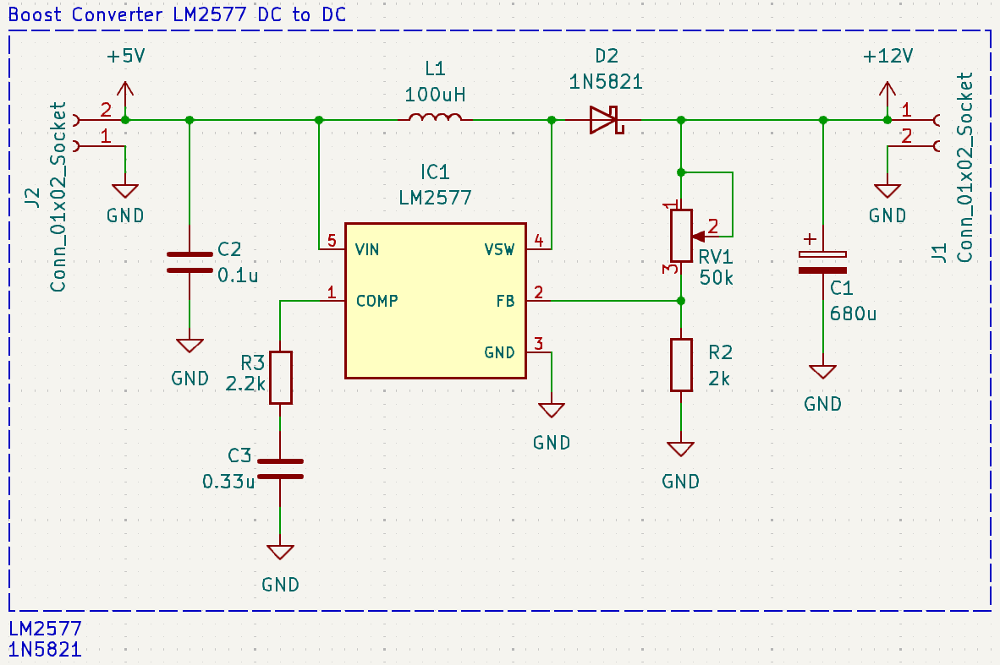
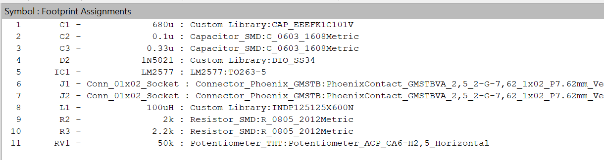
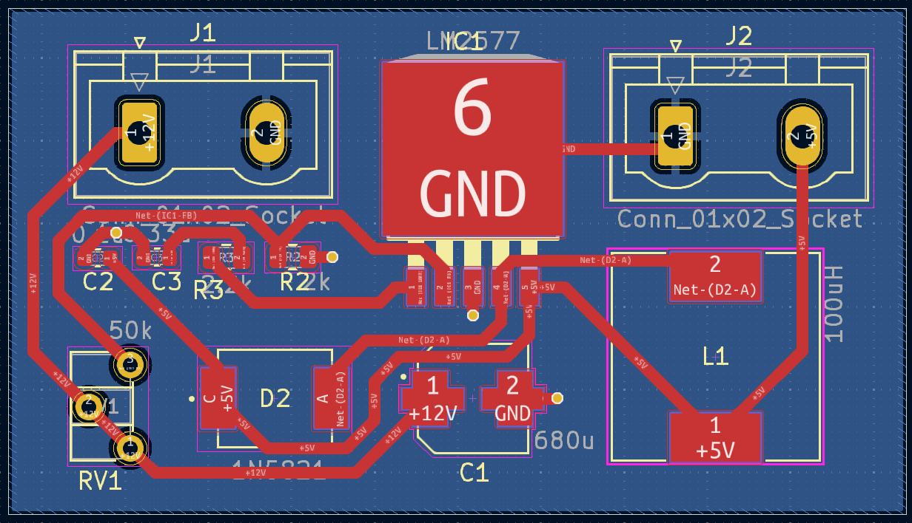
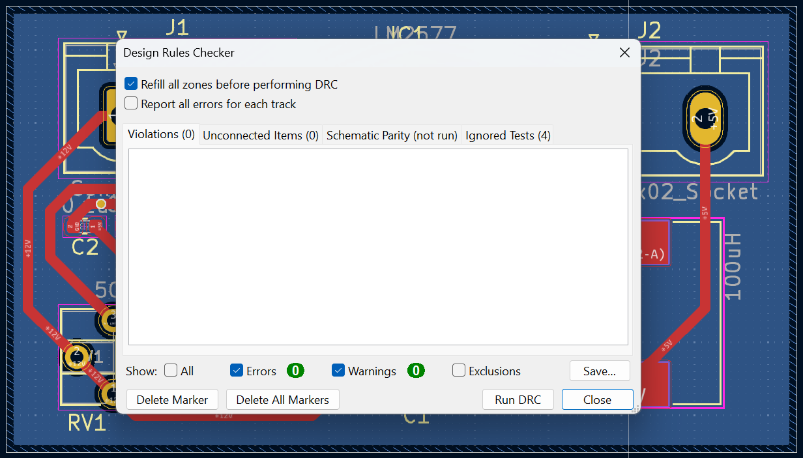
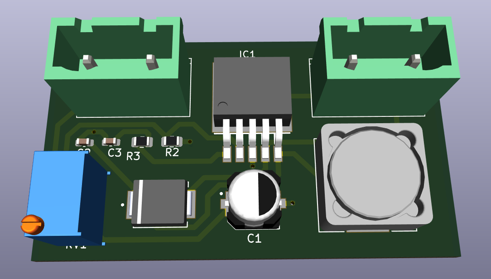
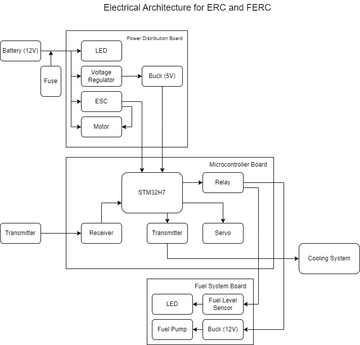

| Nama  | Division        | Sub-Division  |
| ----- | ---------- | ---------- |
| Faizal Fitrohni   | ELC | Microcontroller |

# Electrical Task 3 Submission PCB Revisions
## Schematics Design
Ini adalah gambar desain schematic untuk boost converter dengan menggunakan IC LM2577.

- Di sini saya __menggunakan typical application__ yang ada pada datasheet LM2577. 
- Pada desain boost converter ini saya juga __menggunakan dioda 1N5821__.
- Saya juga __menggunakan potensiometer (RV1)__ untuk mengatur rasio tegangan output dengan tegangan input.

Berikut adalah footprint yang saya gunakan

## PCB Design
Ini adalah gambar desain pcb boost converter saya.

- Saya __menggunakan ground plane__ pada layer back (warna biru) untuk mengurangi _Electromagnetic Interference_ (EMI) yang disebabkan oleh routing ground.
- Saya menggunakan __track dengan lebar 0.7mm__ untuk mengakomodasi power yang tinggi.
- Saya juga menggunakan vias dengan __via diameter 0,8mm__ dan __via hole 0,5mm__ yang menghubungkan komponen SMD dengan ground plane.
- Di sini saya mengusahakan agar induktor dekat dengan IC LM2577 agar loop yang terbentuk kecil. Selain itu, resistor feedback saya jauhkan dengan induktor agar _Electromagnetic Interference_ induktor tidak mengganggu resistor.

Berikut adalah hasil DRC PCB saya

## 3D Model
Berikut adalah 3d Model PCB boost converter saya

# Electrical Task 1 Submission ERC FERC Diagrams

## Electrical Diagram

## Communication Diagram

### 1. Battery (12V)
Sebagai sumber daya utama yang menyediakan listrik untuk seluruh sistem.
### 2. Fuse:
Sebagai pelindung rangkaian dari arus berlebih.

### 3. Power Distribution Board:
1. ___LED___: Indikator visual untuk menunjukkan status daya.
2. ___Voltage Regulator___: Menstabilkan tegangan untuk menghindari fluktuasi yang dapat merusak komponen.
3. ___Buck (5V)___: Mengubah tegangan 12V menjadi 5V untuk komponen yang memerlukan daya lebih rendah.
4. ___ESC (Electronic Speed Controller)___: Mengatur kecepatan dan arah motor.
5. ___Motor___: Menghasilkan gerakan atau daya dorong.

### 4. Microcontroller Board:
1. ___STM32H7___: pengontrol utama untuk memproses data dan memberikan sinyal kendali ke seluruh sistem.
2. ___Relay___: Mengontrol aliran daya ke  pendingin dan fuel system board.
3. ___Servo___: Mengontrol arah gerak kapal 
4. ___Receiver dan Transmitter___: Menerima dan mengirim sinyal pengendali jarak jauh.

### 5. Fuel System Board:
Komponen Utama:
1. ___LED___: Indikator status untuk sistem bahan bakar.
2. ___Fuel Level Sensor___: Mengukur tingkat bahan bakar dalam tangki.
3. ___Fuel Pump___: Memompa bahan bakar ke sistem pembakaran atau mekanisme terkait.
4. ___Buck (12V)___: Menstabilkan tegangan ke komponen sistem bahan bakar.

### 6. Cooling System:
Mengatur suhu sistem agar tetap dalam batas aman.