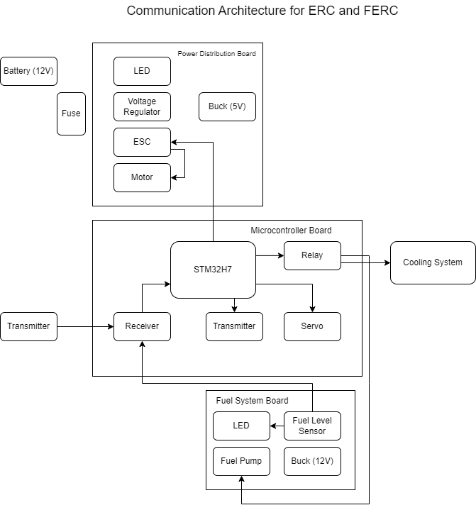

# Electrical Task 1 Submission ERC FERC Diagrams

| Nama  | Division        | Sub-Division  |
| ----- | ---------- | ---------- |
| Faizal Fitrohni   | ELC | Microcontroller |

## Electrical Diagram

## Communication Diagram

### 1. Battery (12V)
Sebagai sumber daya utama yang menyediakan listrik untuk seluruh sistem.
### 2. Fuse:
Sebagai pelindung rangkaian dari arus berlebih.

### 3. Power Distribution Board:
1. ___LED___: Indikator visual untuk menunjukkan status daya.
2. ___Voltage Regulator___: Menstabilkan tegangan untuk menghindari fluktuasi yang dapat merusak komponen.
3. ___Buck (5V)___: Mengubah tegangan 12V menjadi 5V untuk komponen yang memerlukan daya lebih rendah.
4. ___ESC (Electronic Speed Controller)___: Mengatur kecepatan dan arah motor.
5. ___Motor___: Menghasilkan gerakan atau daya dorong.

### 4. Microcontroller Board:
1. ___STM32H7___: pengontrol utama untuk memproses data dan memberikan sinyal kendali ke seluruh sistem.
2. ___Relay___: Mengontrol aliran daya ke  pendingin dan fuel system board.
3. ___Servo___: Mengontrol arah gerak kapal 
4. ___Receiver dan Transmitter___: Menerima dan mengirim sinyal pengendali jarak jauh.

### 5. Fuel System Board:
Komponen Utama:
1. ___LED___: Indikator status untuk sistem bahan bakar.
2. ___Fuel Level Sensor___: Mengukur tingkat bahan bakar dalam tangki.
3. ___Fuel Pump___: Memompa bahan bakar ke sistem pembakaran atau mekanisme terkait.
4. ___Buck (12V)___: Menstabilkan tegangan ke komponen sistem bahan bakar.

### 6. Cooling System:
Mengatur suhu sistem agar tetap dalam batas aman.